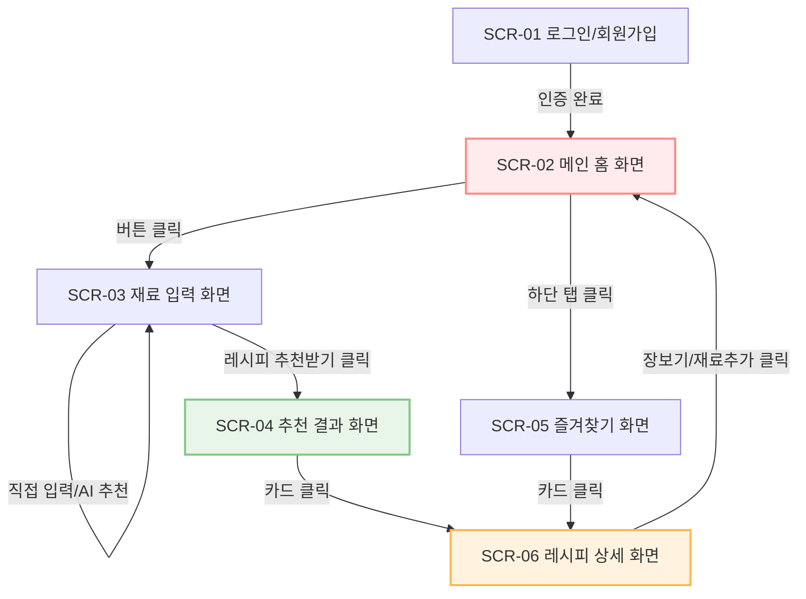

# 📱 [냉털쿡] 화면 요구사항 정의서 (UI/UX Specification)

본 화면 요구사항 정의서는 자취생 요리 도우미 앱 **'냉털쿡'**의 각 핵심 화면 레이아웃, UI 요소, 사용자 인터랙션 흐름을 정의합니다. 본 문서의 와이어프레임 구조는 원본 기획 설계서(PDF)의 텍스트 배치 및 구조를 엄격히 준수하여 도출되었습니다.

---

## 1. 화면 흐름도 (Screen Flow Diagram)

사용자의 주요 여정(User Journey)에 따른 화면 간의 관계 및 전환 흐름은 다음과 같습니다.

---

## 2. 화면별 상세 요구사항 (Detailed Screen Requirements)

### 2.1 [SCR-01] 로그인/회원가입 화면
* **화면 설명**: 서비스 진입 시 노출되는 사용자 인증 화면으로, 단순하고 직관적인 레이아웃을 제공합니다.
* **UI 구성 요소**:
  * **로고 및 슬로건**: 대형 타이틀 `"냉털쿡"`, 서브텍스트 `"냉장고 재료로 쉽게 요리하세요"`
  * **입력 필드**: 
    * ID 입력 박스 (`"아이디를 입력해주세요"`)
    * PW 입력 박스 (`"비밀번호를 입력해주세요"`, 비밀 마스킹 처리 `●●●●`)
  * **실행 버튼**: `"로그인"`, `"회원가입"`, `"비밀번호 찾기"`, 분할 구분자 `"or"`
* **인터랙션/특이사항**:
  * 아이디 및 비밀번호 미입력 시 '로그인' 버튼은 비활성화(Disabled) 상태를 유지합니다.
  * 로그인 실패 시 하단에 빨간색 경고 메세지(`"아이디 또는 비밀번호가 틀렸습니다."`)가 노출됩니다.

---

### 2.2 [SCR-02] 메인 홈 화면
* **화면 설명**: 서비스의 메인 로비 화면으로, 핵심 기능인 '직접 입력'과 '사진 입력(AI)'으로 빠르게 분기할 수 있습니다.
* **UI 구성 요소**:
  * **헤더**: `"냉털쿡"` 로고 및 알림 아이콘
  * **주요 기능 버튼 카드**:
    1. **재료 입력하기 카드**:
       * 설명 텍스트: `"냉장고 속 재료로 맛있는 요리를 추천받아보세요!"`
       * 클릭 시: `[SCR-03] 재료 입력 화면`으로 이동.
    2. **사진으로 재료 찾기 카드**:
       * 설명 텍스트: `"사진을 찍으면 재료를 자동으로 인식해요!"`
       * 클릭 시: 카메라 촬영 기능 활성화 혹은 갤러리 열기 팝업 노출.
  * **오늘의 추천 메뉴 섹션**:
     * 우측 상단 `"더보기>"` 버튼 연동
     * **추천 메뉴 리스트 카드** (3종):
       * `김치볶음밥` (15분 - 쉬움)
       * `계란말이` (10분 - 쉬움)
       * `제육덮밥` (20분 - 중간)
  * **하단 네비게이션 바 (공통)**: `홈(활성) | 검색 | 즐겨찾기 | 마이페이지`
* **인터랙션/특이사항**:
  * 추천 메뉴 카드를 터치하면 즉시 해당 레시피의 `[SCR-06] 레시피 상세 화면`으로 이동합니다.

---

### 2.3 [SCR-03] 재료 입력 화면
* **화면 설명**: 사용자가 냉장고 속에 가지고 있는 식재료를 검색 및 터치로 입력하여 임시 카트에 담는 화면입니다.
* **UI 구성 요소**:
  * **상단 헤더**: 타이틀 `"재료 입력"`, 우측 완료 링크 `"완료"`
  * **검색 창 및 음성 검색**: 
    * 플레이스홀더 `"재료를 검색해 주세요"` (입력 시 실시간 자동 완성)
    * 검색창 우측 **마이크 아이콘 (🎙️)** 배치 (음성 인식 입력을 통한 빠른 검색 기능 연동)
  * **추천 재료 섹션**: 사용 빈도가 높은 인기 재료 태그 버튼 제공
    * 구성 태그: `계란`, `양파`, `당근`, `김치`, `두부`, `감자`, `대파` 등
  * **내가 입력한 재료 섹션**:
    * 실시간 선택한 재료 개수 카운팅 노출 (예: `"내가 입력한 재료 (4)"`)
    * 입력된 재료들이 칩(Chip) 뱃지 모양으로 렌더링됨 (예: `계란 X`, `양파 X`, `된장 X`, `김치 X`, `두부 X`)
    * 우측 상단 `"전체삭제"` 링크
  * **하단 메인 액션 버튼**: `"레시피 추천받기"`
* **인터랙션/특이사항**:
  * 검색창 우측의 **마이크 아이콘 (🎙️)**을 터치하면 모바일 기기 자체 음성 입력(STT) 팝업이 호출되며, 음성 인식으로 입력된 텍스트가 검색창에 자동으로 채워지고 해당 재료가 입력 목록에 즉시 반영됩니다.
  * 추천 재료 태그를 누르면 화면 하단 '내가 입력한 재료' 리스트에 칩(Chip) 형태로 즉시 추가됩니다.
  * 칩 우측의 'X' 버튼을 누르면 해당 재료만 단독 삭제됩니다.
  * 재료가 1개 이상 입력되어야만 `"레시피 추천받기"` 버튼이 주황색/빨간색 테마로 활성화됩니다.

---

### 2.4 [SCR-04] 추천 결과 화면
* **화면 설명**: 입력된 재료를 AI 엔진이 매칭 및 분석하여 조리 가능한 요리와 부족한 재료를 우선순위대로 정렬해 주는 화면입니다.
* **UI 구성 요소**:
  * **상단 헤더**: 타이틀 `"추천 결과"`, 우측 `"완료"` 링크
  * **상단 정보 안내**: `"입력한 재료로 만들 수 있는 요리예요!"`
  * **추천 요리 목록 카드**:
    * 각 요약 카드 내 부족한 재료 정보 우측에 퀵 **`장보기 추가 (🛒)`** 아이콘 버튼을 배치합니다.
    1. **김치볶음밥 카드**:
       * 메타데이터: `15분 | 쉬움`
       * 부족한 재료 피드백: **`부족한 재료 : 쪽파`** (빨간색 강조) | **`장보기 추가` (🛒 버튼)**
    2. **계란말이 카드**:
       * 메타데이터: `15분 | 쉬움`
       * 부족한 재료 피드백: **`부족한 재료 : 대파, 당근`** | **`장보기 추가` (🛒 버튼)**
    3. **김치찌개 카드**:
       * 메타데이터: `15분 | 중간`
       * 부족한 재료 피드백: **`부족한 재료 : 두부, 대파`** | **`장보기 추가` (🛒 버튼)**
  * **하단 네비게이션 바 (공통)**: `홈 | 검색 | 즐겨찾기 | 마이페이지`
* **인터랙션/특이사항**:
  * 각 요리 카드 내의 **`장보기 추가 (🛒)`** 버튼을 터치하면, 화면이 전환되지 않고 백그라운드 데이터베이스의 장보기 목록에 즉시 추가되며 하단에 **`"부족한 재료가 장보기 목록에 추가되었습니다."`** 토스트 팝업이 띄워집니다.
  * 매칭률이 높은 레시피가 최상단에 자동 정렬됩니다.
  * 부족한 재료 항목은 회색 또는 연한 적색 폰트로 강조하여 한눈에 식별할 수 있게 처리합니다.

---

### 2.5 [SCR-05] 즐겨찾기 화면
* **화면 설명**: 사용자가 하트 또는 별표 표시하여 저장해 둔 나만의 단골 레시피들을 일괄적으로 보관하고 관리하는 공간입니다.
* **UI 구성 요소**:
  * **상단 헤더**: 타이틀 `"즐겨찾기"`, 우측 `"편집"` 버튼 (다중 선택/삭제 모드 전환)
  * **안내 텍스트**: `"즐겨 드시는 음식 목록이에요!"`
  * **즐겨찾기 요리 목록 카드**:
    * `김치볶음밥` (15분 · 쉬움)
    * `된장찌개` (20분 · 중간)
    * `제육볶음` (15분 · 쉬움)
  * **하단 네비게이션 바 (공통)**: `홈 | 검색 | 즐겨찾기(활성) | 마이페이지`
* **인터랙션/특이사항**:
  * `"편집"` 버튼을 누르면 목록 내 카드 왼쪽에 체크박스(Checkbox)가 나타나며, 여러 개를 선택해 일괄 제거할 수 있습니다.

---

### 2.6 [SCR-06] 레시피 상세 화면
* **화면 설명**: 특정 요리를 조리하기 위한 재료 목록과 상세 가이드 단계를 사용자 중심의 가독성 높은 그리드로 연출하는 최하위 화면입니다.
* **UI 구성 요소**:
  * **상단 영역**:
    * 요리 타이틀: `"김치볶음밥"`
    * 핵심 요약 스펙 뱃지: `⏱ 15분 | 👥 1~2인분 | 🍳 쉬움`
  * **재료 섹션 (Ingredients)**:
    * `김치 1 컵`, `밥 한 공기`, `간장 2 스푼`, `소금 반 스푼`, `파 (50g)`, `깨 반 스푼`
  * **요리 순서 섹션 (Step-by-Step)**:
    1. 후라이팬에 기름을 두르고 김치를 볶는다.
    2. 김치를 볶고 가장자리에 간장 1스푼을 넣고 태운다.
    3. 밥을 넣고 고슬고슬하게 볶는다.
    4. 소금으로 간을 맞춘다.
    5. 불을 끄고 김가루와 깨를 뿌리고 맛있게 먹는다.
  * **하단 인터랙션 플로팅 버튼**:
    * `"재료 추가"`: 사용자의 개인 쇼핑 카트 메모에 본 레시피 재료를 복사합니다.
    * `"재료 구매"`: 제휴 이커머스(쿠팡, 컬리 등)로 연동되어 즉시 결제할 수 있는 외부 링크를 활성화합니다.
  * **하단 네비게이션 바 (공통)**: `홈 | 검색 | 즐겨찾기 | 마이페이지`
* **인터랙션/특이사항**:
  * 조리 도중 스마트폰 화면이 꺼지지 않도록 '화면 켜짐 유지(Wake Lock)' 기능을 백그라운드에 적용할 수 있습니다.
  * 요리 순서 항목 옆에 체크박스를 배치하여, 완료한 단계를 체크하면서 진행할 수 있도록 사용자 편의를 도모합니다.
